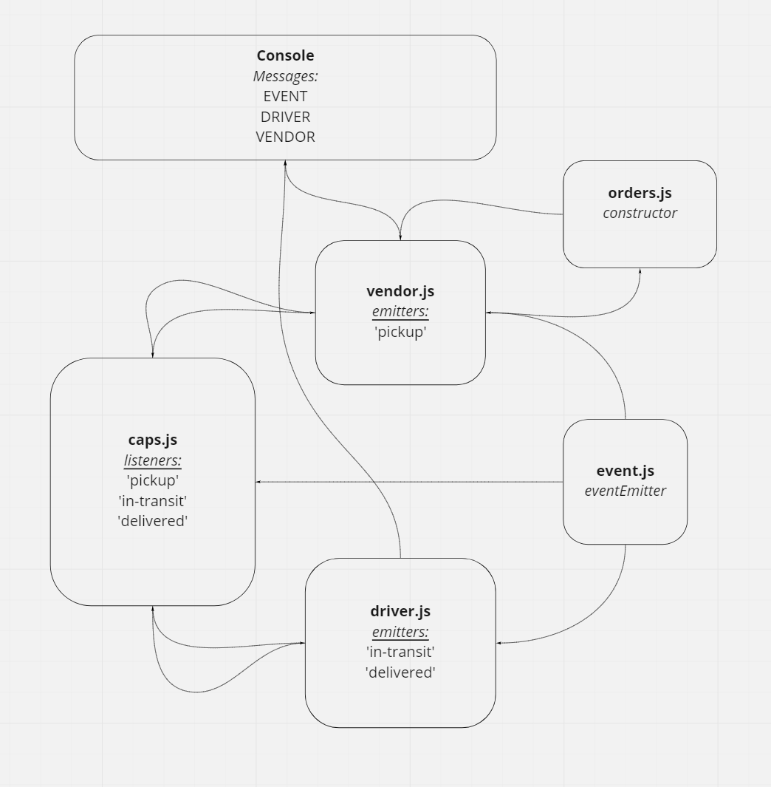

# Event Driven Applications

## Overview

Begin the build of an application for a company called CAPS - The Code Academy Parcel Service. In this sprint, we’ll build out a system that emulates a real world supply chain. CAPS will simulate a delivery service where vendors (such a flower shops) will ship products using our delivery service and when our drivers deliver them, be notified that their customers received what they purchased.

## Author: William Moreno

## Collaboration

- Carly Dekock
- James Gerstenberger
- Jason Dormier
- Jason Quaglia
- Nick Magruder

## Dependencies / Getting Started

clone the repository

run `npm install` in the terminal

Requires an .env file with the following values:

STORENAME='The Stuff Store'

## Daily Pull Request

Work was accomplished on the `events` branch. The pull request to merge the code into the `main` branch is here:

- [Pull Request](https://github.com/William-Moreno/caps/pull/1)

Working features implemented:
- Created `events.js` as a global event pool
- Created `caps.js` as the main hub application
- Created `vendor.js` vendor module
- Created `driver.js` driver module 

## Tests

Test suite generated to test event handlers:

  run `npm test` from the terminal

  - All tests successfully passed.

## UML

UML drawing created with [miro](https://miro.com/)

